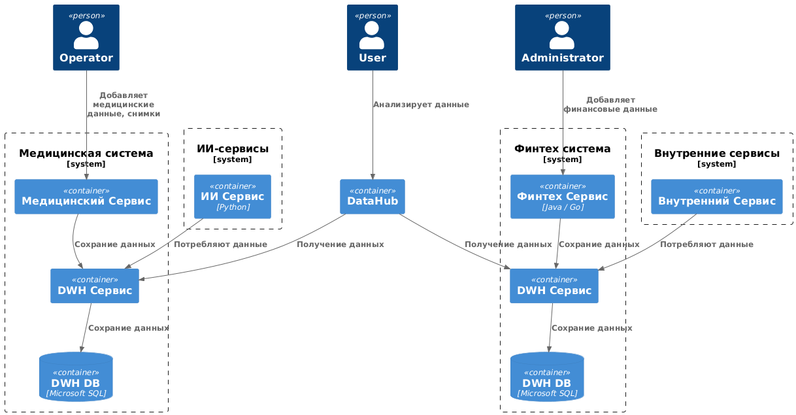

# C4

Диаграмма контейнеров:

# Проблемные места

Основыне проблемные места заключаются:
1. Разбиение системы по доменам: определение какие данные будут храниться в каких системах и определение ответственных за эти данные;
2. Появление новых данных в своих системах, а затем миграция исторических данных из общего DWH в собственный, чтобы реализовать подход Data Mesh;
3. Создание аналитических отчетов посредством использования новых и старых систем.

# Приоритезация проблем

Проблемы приоритезируются по **MoSCoW**:
- **Must have**:
    1. Разбиение системы по доменам;
    2. Определение данных, которые хранятся в системах;
    3. Согласование данных между командами;
    4. Определение ответственных за домены;
    5. Аналитика данных которые расположены в разных системах.
- **Should have**:
    1. Перевоз исторических данных;
- **Could have**:
    1. Согласованость форматов старых и новых данных при миграции;
- **Won't have**;
