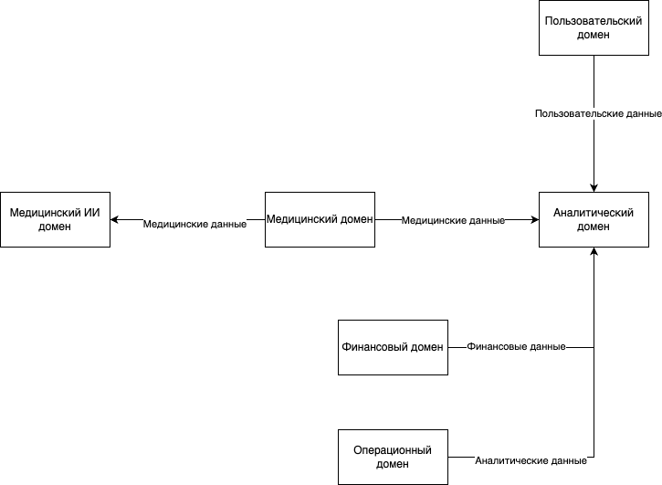

# Домены

Основные домены:
1. Финансовый домен, который отвечает за все операции и данные, которые связаны с финансами, а именно:
    - Финансовая история;
    - Данные о кредитах;
    - Счета;
    - Финансовая отчетность и много другой информации.
2. Пользовательский домен, который отвечает за все операции и данные, которые связаны с клиентами, а именно:
    - Данные по клиентам.
3. Медицинский домен, который отвечает за все операции и данные, которые связаны с медициной и лечением клиентов, а именно:
    - Медицинские карты и истории болезни, в том числе — данные исследований, выполненных в ходе лечения.
4. Операционный домен, который отвечает за все операции и данные, которые связаны с больницами, персоналом и оборудованием, а именно:
    - Данные по персоналу больницы;
    - Данные по инвентаризации.
5. Медицинский ИИ домен, который является потребителем медицинских данных и анализирует эти данные;
6. Аналитический домен, который является потребителем данных из всех доменов для их анализа и отображения.

# Потоки данных

# Преимущества разделения

Основные преимущества:
1. Каждая команда будет отвечать за свои данные, их обработку, трансформацию, хранение и продажу другим командам;
2. Изоляция данных в разных хранилищах, что позволяет усилить безопасность;
3. Отделение медицинских данных от других данных, что позволяет ИИ сервисам работать только с ними и не получать другие данные и в свою очередь аналитика не будет знать ничего о медецинских данных;
4. В следствии изоляции данных в своих доменах будет улучшаться их качество, так как за данные отвечает команда, которая их поставляет;
5. Уменьшение размеров общего хранилища данных, так как становится много локальных хранилищ для каждого домена.
